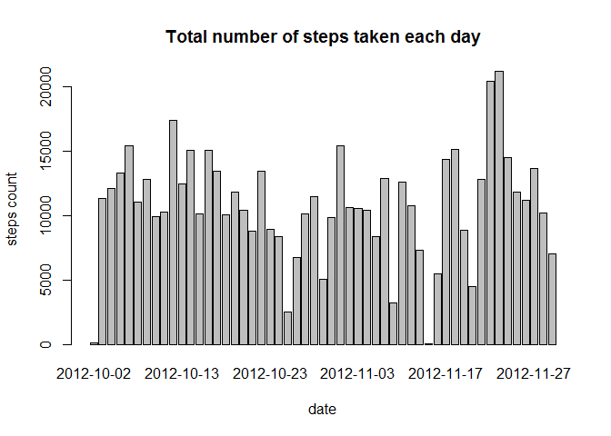
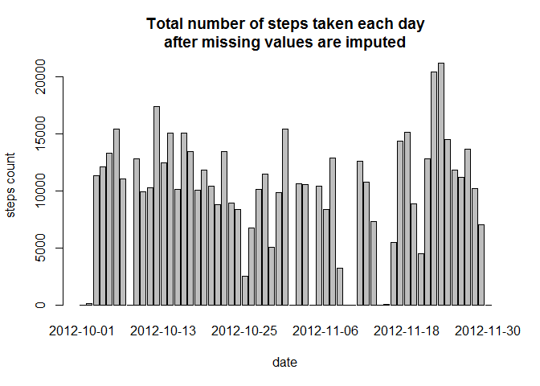
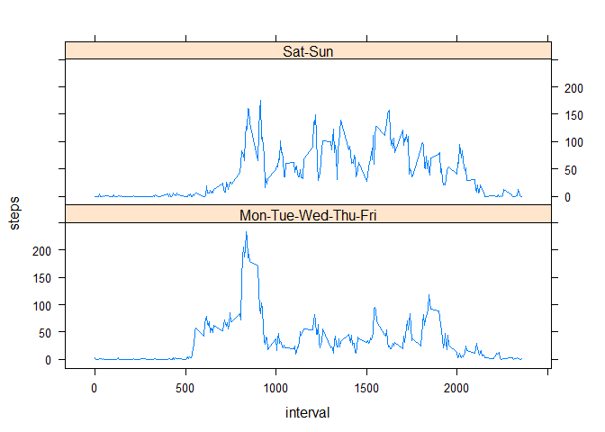

# Reproducible Research: Peer Assessment 1


## Loading and preprocessing the data

The following operations are performed:  
1.  Load the data,  
2.  process/transform the data into a format suitable for your analysis  


```r
if (!file.exists("activity.csv")) {
        unzip("activity.zip")
}
rawdata <- read.csv("activity.csv", colClass=c('integer', 'Date', 'integer'))

steps <- aggregate(steps ~ date, data=rawdata, FUN=sum, na.rm=TRUE)
```


## What is mean total number of steps taken per day?

Histogram of the total number of steps taken each day  

```r
names(steps)<-c("date","count")
library(ggplot2)
barplot(steps$count, names.arg=steps$date, main="Total number of steps taken each day",
        xlab="date", ylab="steps count")
```

<!-- -->

The following code calculates the mean and median number of steps taken each day  

```r
mean.step.eachday <-  mean(steps$count, na.rm=TRUE)
median.stem.eachday <- median(steps$count, na.rm=TRUE)
```

The mean is 1.0766189\times 10^{4} and the median is 10765.  

## What is the average daily activity pattern?

Time series plot of the 5-minute interval (x-axis) and the average number of steps taken, averaged across all days (y-axis)

```r
avgs <- aggregate(x=list(steps=rawdata$steps), by=list(interval=rawdata$interval),
                      FUN=mean, na.rm=TRUE)
plot(avgs, type='l', main="Average number of steps taken")
```

<!-- -->

```r
avgs.maxnumsteps <- avgs[which.max(avgs$steps),]
```

The 835th 5-minute interval is the one that, on average, contains the maximum number of steps with 206.1698113 steps.

## Imputing missing values

Total number of missing values in the dataset (i.e. the total number of rows with NAs):

```r
sum(is.na(rawdata$steps))
```

```
## [1] 2304
```

The code below implements  a strategy for imputing missing data and consists in replacing each missing value in an interval with the mean value of the day the interval belong to.  

Since the aggregate function does not consider NA by default and so some dates would be lost, na.action=NULL is used to tell aggregate not to skip NAs. This imply that some dates will have a NaN mean, which will be replaced by a 0.  


```r
steps.avg.perday <- aggregate(steps ~ date, data=rawdata, FUN=mean, na.rm=TRUE, na.action=NULL) 
names(steps.avg.perday)<-c("date","stepsAvg")
nan <- is.nan(steps.avg.perday$stepsAvg)
steps.avg.perday$stepsAvg[nan]<-0
data <- merge(rawdata, steps.avg.perday, by="date", na.rm=TRUE)
data["noNAsteps"] <- data$steps
nas <- is.na(data$steps)
data$noNAsteps[nas] <- data$stepsAvg[nas]
```
Histogram of the total number of steps taken each day after missing values are imputed

```r
steps <- aggregate(stepsAvg ~ date, data=data, FUN=sum)
barplot(steps$stepsAvg, names.arg=steps$date, main="Total number of steps taken each day\nafter missing values are imputed",
        xlab="date", ylab="steps count")
```

<!-- -->

```r
mean.step.noNA.eachday <-  mean(data$noNAsteps, na.rm=TRUE)
median.step.noNA.eachday <- median(data$noNAsteps, na.rm=TRUE)
```

The new mean and median of the total number of steps taken per day are 32.4799636 and 0 respectively.  

## Are there differences in activity patterns between weekdays and weekends?

Create a new factor variable in the dataset with two levels - "weekday" and "weekend" indicating whether a given date is a weekday or weekend day:

```r
GetwdORwe <- function(date) 
{
        if (weekdays(date) %in% c("Saturday", "Sunday")) 
        {
                "Sat-Sun"
        }
        else 
        {
                "Mon-Tue-Wed-Thu-Fri"
        }
}
Sys.setlocale("LC_TIME", "English")
```

```
## [1] "English_United States.1252"
```

```r
data$wdORwe <- sapply(data$date, FUN=GetwdORwe)
```

Panel plot containing a time series plot of the 5-minute interval (x-axis) and the average number of steps taken, averaged across all weekday days or weekend days (y-axis). 


```r
library(lattice)
steps.interval.wdORwe <- aggregate(steps ~ interval + wdORwe, data, mean)
xyplot(steps ~ interval | wdORwe, data=steps.interval.wdORwe, layout=c(1,2), type='l')
```

<!-- -->
